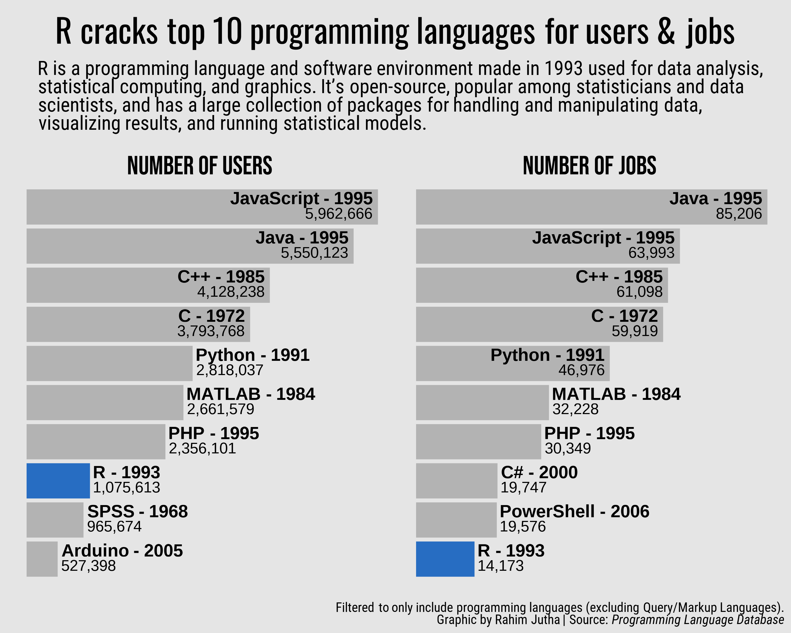
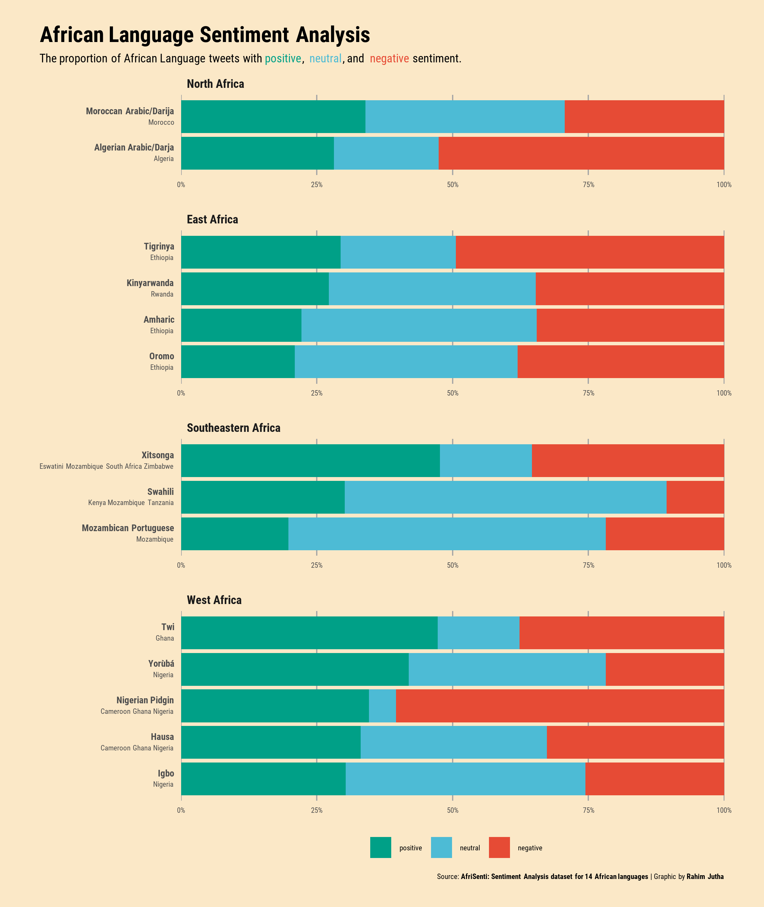
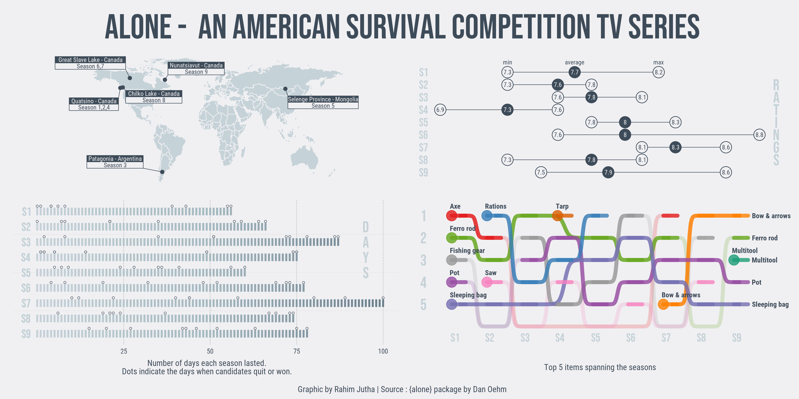
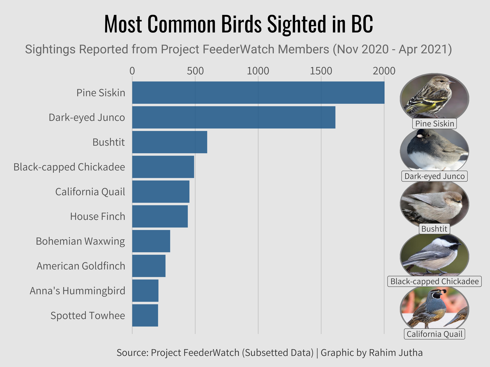

Rahim Jutha / rahimjuthaguy@gmail.com / [Linkedin Profile](https://www.linkedin.com/in/rahim-jutha/)

Click on header for the code.

## [03-21-2023-Programming-Languages](https://github.com/rjutha/Tidy-Tuesday/tree/main/scripts/2023-08-22-Refugees/line_chart.qmd)

</a>

## [03-21-2023-Programming-Languages](https://github.com/rjutha/Tidy-Tuesday/tree/main/scripts/03-21-2023-Programming-Languages/Programming%20Langauges.Rmd)

</a>

## [02-28-2023-African-Language-Sentiment](https://github.com/rjutha/Tidy-Tuesday/tree/main/scripts/02-28-2023-African-Language-Sentiment/African%20Language%20Sentiment.Rmd)

</a>

## [01-24-2023-Alone-Series](https://github.com/rjutha/Tidy-Tuesday/tree/main/scripts/01-24-2023-Alone-Series/Alone%20Analysis.Rmd)

</a>

## [01-10-2023-Project-FeederWatch](https://github.com/rjutha/Tidy-Tuesday/tree/main/scripts/01-10-2023-Project-FeederWatch/eda_model.Rmd)

</a>