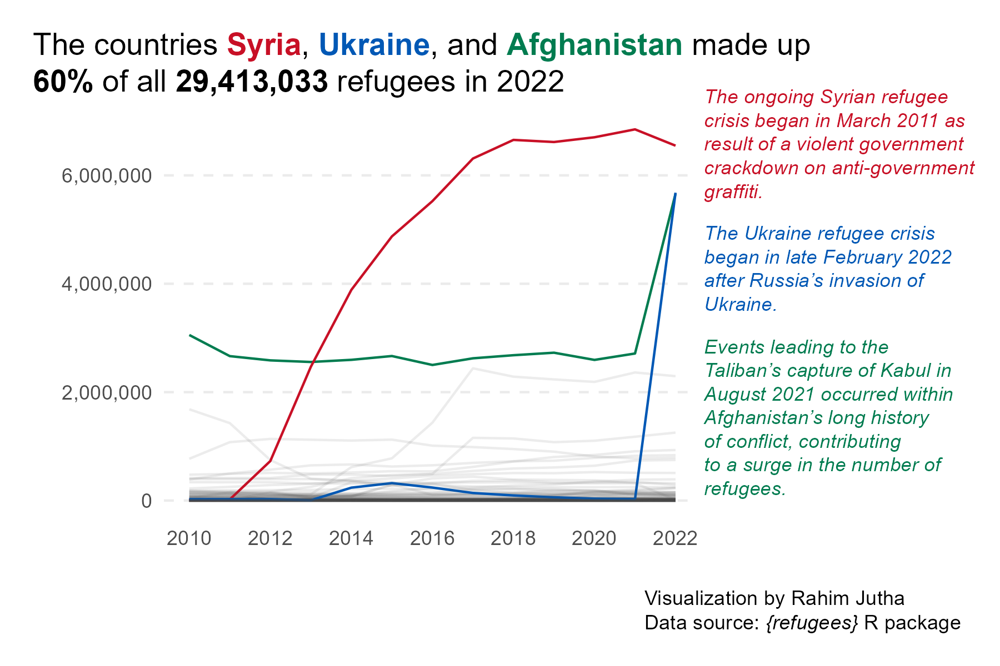

# 2023-08-22-Refugees
 Tidy Tuesday Visualization for Programming Languages

Rahim Jutha / rahimjuthaguy@gmail.com / [Linkedin Profile](https://www.linkedin.com/in/rahim-jutha/)

Please scroll down to view the final visualization

## Description 
For this tidy tuesday I wanted to try to use the waffle package in R.
I couldn't quite figure out what I wanted to show using it so I decided to make a line chart instead.
With this visualization I practiced using the annotate function to add more information.

## Skills:
- Data Manipulation
- Data Visualization

## Tools:
- R
- Tidyverse
- ggplot2

## References
- https://github.com/rfordatascience/tidytuesday/blob/master/data/2023/2023-08-22/readme.md
- https://www.unrefugees.org/news/syria-refugee-crisis-explained/
- https://www.worldvision.org/disaster-relief-news-stories/ukraine-crisis-facts-faqs-and-how-to-help
- https://www.unrefugees.org/news/afghanistan-refugee-crisis-explained/

Feel free to contact me with any comments 

